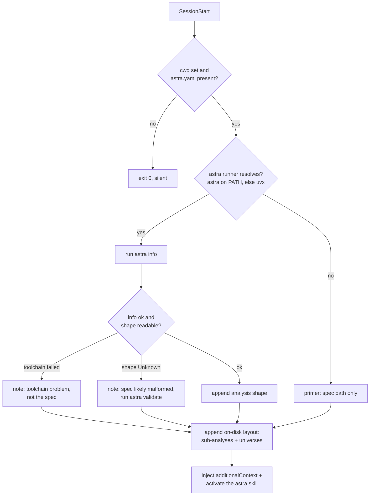
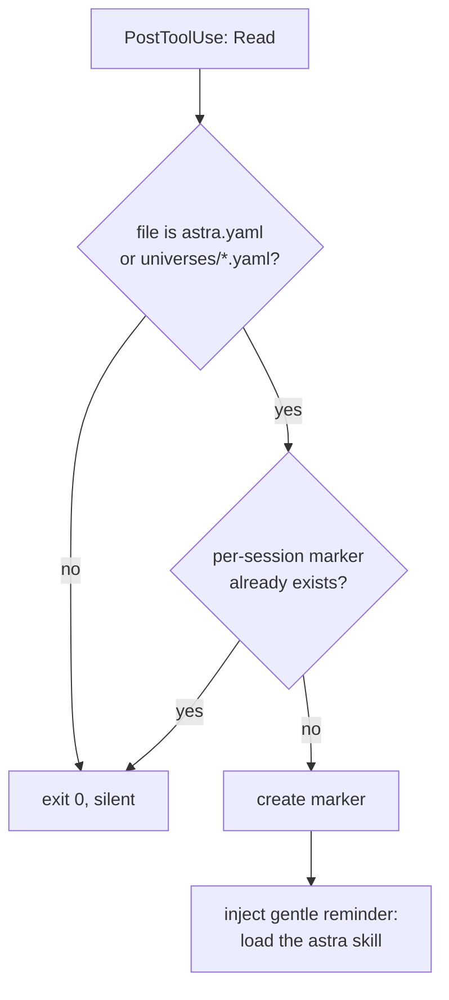
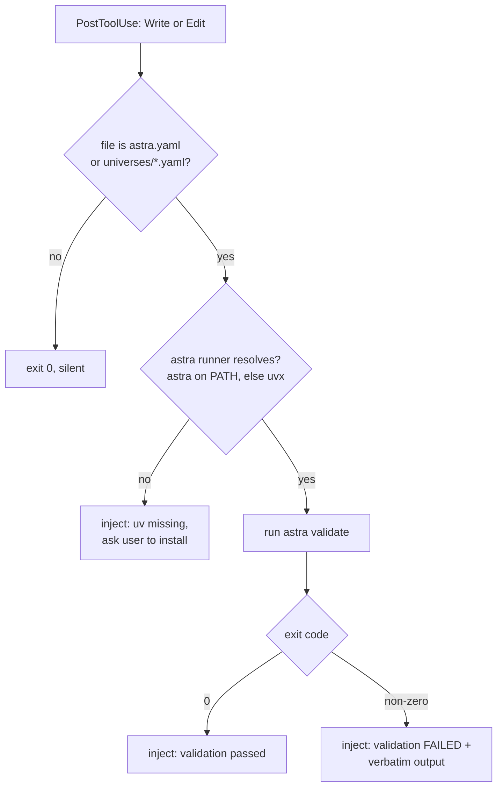

# astra plugin hooks

Three hooks keep an agent oriented in an ASTRA project. Each one reads the hook
event on stdin, checks a few conditions, and either injects
`additionalContext` or exits silently. None of them ever block a tool call.

The toolchain pins (`ASTRA_TOOLS_PIN` / `ASTRA_SPEC_PIN`) and the `astra`
runner resolution live in `scripts/astra-pins.sh`, sourced by the two hooks
that run `astra`. Every hook command locates the plugin root as
`${CLAUDE_PLUGIN_ROOT:-$PLUGIN_ROOT}`, so one `hooks.json` serves every harness.

## SessionStart — spec primer (`astra-session-start.sh`)

Fires once at session start. Orients the agent in the spec: where `astra.yaml`
lives, the analysis shape (`astra info` header — name, version, input/output/
decision counts), and the on-disk layout (sub-analysis and universe file
counts). It does **not** run `astra validate` (that is validate-on-save's job)
and says nothing about `lc` execution (that is the lightcone plugin's own hook).

## PostToolUse:Read — skill nudge (`activate-on-read.sh`)

Fires after every `Read`. When the file read is an ASTRA file (`astra.yaml` at
any depth, or `universes/*.yaml`), it drops a soft, once-per-session reminder to
load the astra skill. A per-session marker file suppresses repeats, so an agent
already oriented is not nagged. It injects only a reminder — it never validates,
runs a tool, or blocks.

## PostToolUse:Write|Edit — validate on save (`validate-on-save.sh`)

Fires after every `Write` or `Edit`. When the written file is an ASTRA file
(`astra.yaml` at any depth, or `universes/*.yaml`), it runs `astra validate` and
pushes the verbatim result back to the agent — pass or fail. If neither `astra`
nor `uv` is available it asks the user to install `uv`; it never installs
anything itself. Output is surfaced as-is, with no parsing.

